

  

# ccLoad Desktop

**Desktop client for ccLoad — for Claude Code, Codex, Gemini, Grok Build, and OpenCode.**

**English | [简体中文](./README.zh-CN.md)**

> Point every CLI at one gateway | Local or remote | Keep your MCP | Undo a takeover | Try in a sandbox first | Ships its own vision and image MCP

  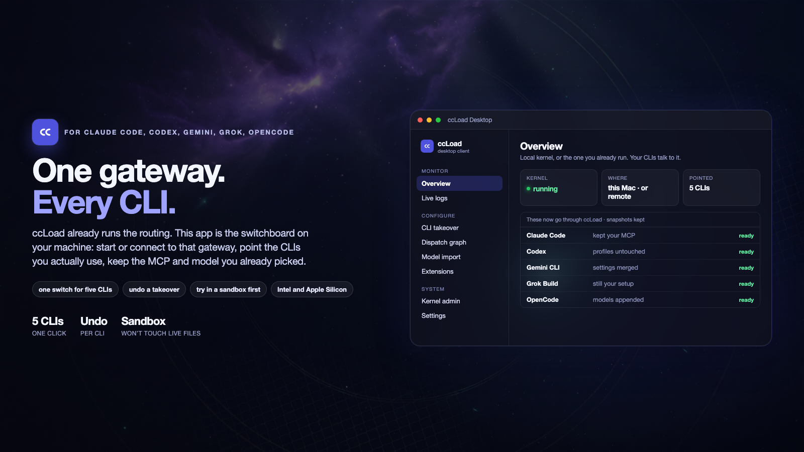

ccLoad already removes the operational mess of multiple AI API upstreams: routing, failover, protocol conversion, usage. What is still messy is the laptop — five coding CLIs, five “send requests here” settings. Changing gateways means pasting an address five times. Many switchers rewrite the whole file and take your MCP servers and current model with them.

ccLoad Desktop is the window that closes that gap. Start a local [ccLoad](https://github.com/caidaoli/ccLoad), or connect to one you already run, then point the CLIs you actually use at it. You keep working in the same terminals. Channels and keys stay in ccLoad.

## Who, what, why, when, where, how

| | |
|---|---|
| **Who** | Anyone already using Claude Code, Codex, Gemini CLI, Grok Build, or OpenCode, who runs (or is about to run) ccLoad as the gateway. |
| **What** | A desktop switchboard. Not another proxy — the app that connects that gateway to those five CLIs. |
| **Why** | Routing, cooldown, and billing already live in ccLoad. On the machine you still edit five configs by hand, miss one, and watch a session hit the old endpoint; typical switchers overwrite the whole file. |
| **When** | A new CLI, a new gateway, a friend’s instance, a suspicion that one tool is still on the old URL, or a trial that must not touch the live session. |
| **Where** | The gateway can be this computer, a box at home, or a shared server. The CLIs stay in the terminals you already use. Installers for Windows, macOS, and Linux; one Mac build covers Intel and Apple Silicon. |
| **How** | Open the app → start local ccLoad or paste an existing URL → takeover the CLIs you use → keep using those CLIs as before → come back here for usage, health, and logs. |

  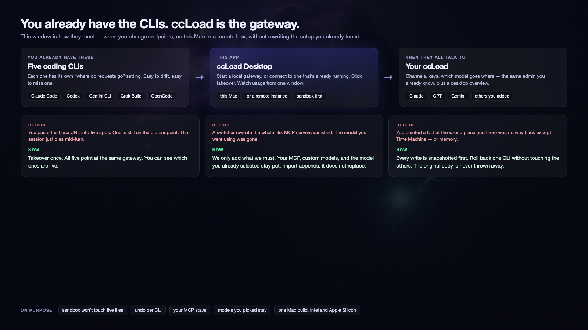

## What it solves

If you keep several AI CLIs open, these are the failure modes:

- **The URL has to be pasted five times.** Each tool has its own endpoint. Miss one when you change gateways, and that session dies mid-turn on the old address.
- **A switcher wipes the room.** Whole-file replace is how MCP servers vanish and the model you were using gets swapped out.
- **The wrong CLI has no undo.** Without a snapshot you are left with memory, or a full-disk backup.
- **You want a trial without burning the live session.** Comparing two gateways should not use the real `~/.claude` as the lab.
- **The gateway is up, the laptop is blind.** Usage, in-flight requests, and channel health still mean opening a browser and guessing.
- **You paste a screenshot and the model cannot see it.** A text-only model does not know it is blind — it guesses from the filename. Generating an image is worse: it never occurs to the model that it could just draw one, so it sends you off to another tool or fakes it with SVG.
- **A session dies on `400 too long`.** Claude Code decides when to auto-compact from the window the **model** declares, while the ceiling that actually stops you belongs to the **relay**. When those two disagree, the threshold is computed against a denominator that does not exist — by the time it fires you are already past the real ceiling, and `/compact` cannot save you either, because it has to send the whole transcript too.

ccLoad Desktop handles those cases with:

- **One takeover, only the CLIs you use.** You do not open five config files.
- **Add what is needed, never replace the file.** MCP, custom models, and fields you typed stay. Import appends to the catalog; it does not change the model you have selected.
- **A snapshot before every write.** Roll back that CLI only. The first copy is never thrown away.
- **A sandbox.** Writes land in a side folder until you turn sandbox off.
- **An overview that matches the gateway.** Spend, health, live requests, logs — the same ccLoad numbers, not a second counter.
- **Eyes and hands for every CLI.** Two bundled MCP servers — see the next section.
- **Trimming against the real ceiling.** Token counts come from the usage the upstream reported, not from an estimate.

## The two bundled MCP servers

Both are compiled **into the same binary as the app** and dispatched by `argv[1]` (`vision-mcp` / `image-mcp`). Installing one writes a single command plus a few environment variables into that CLI's native MCP config — no extra runtime to download, no resident background process, and uninstalling is deleting that one entry. Requests go through the gateway you already configured, so channels, failover and billing are shared with the rest of your traffic.

### `ccload-vision` — sight for models that have none

Hands the image to a multimodal model and gives the text back to the model you are talking to.

| Tool | For |
|---|---|
| `describe_image` | Understand an image: screenshot, photo, diagram, chart |
| `read_image_text` | Transcribe the text verbatim. Use it for error screenshots, terminal output, logs, forms — `describe_image` summarises, and these need the exact words |
| `compare_images` | Diff two images: before/after, visual regression |
| `list_pasted_images` | List what was just pasted, with on-disk paths |
| `describe_screen` | Capture the current screen and describe it (macOS only) |

Three ways to point at an image, all accepted: `path` for a local file, `url` for a remote or data URL, and `image` for a paste index (`"1"` is `[Image 1]`, `"latest"` is the newest). **The index matters** — a transcript often shows only the `[Image 1]` placeholder with no path, and without it the model's only move is asking you to save a copy and send the path back.

### `ccload-image` — let the CLI draw

`generate_image` makes a new image from a description. `edit_image` changes an existing one and **saves the result as a new file, leaving the original untouched**; `extra_paths` composes several references into one.

What it handles for you:

- **It picks the endpoint.** Upstreams expose image generation two entirely different ways: `/v1/chat/completions` with `modalities:["image"]`, and `/v1/images/generations`. There is no consistent rule for which model wants which, and getting it wrong fails every single time — with an error phrased by the upstream ("this model is not available on this endpoint"), so nobody thinks to come back and change a dropdown in a client. The default, Auto, orders the attempts by model name and retries on the other endpoint the moment the upstream says it is the wrong one. Only wrong-endpoint errors are retried — quota, rate limits and refused prompts do not burn a second call.
- **The request body is written per provider.** The kernel registers no cross-protocol conversion for the images family, so whatever we send arrives verbatim. xAI does not accept `size` and wants `aspect_ratio` + `resolution`; dall-e returns a link unless you ask for base64; gpt-image is the opposite and rejects that parameter outright. Those differences are absorbed here.
- **Size takes either notation.** Aspect ratio (`16:9`, `1:1@2k`) or pixels (`1024x1536`) — converted to a value the configured model actually accepts.
- **Results go to disk; the model gets a path.** Returning the image itself would pour a megabyte of base64 into the transcript per picture — exactly what Session rescue exists to clean up. To check what was drawn, call `describe_image` on that path.
- **The extension follows the magic bytes**, not the declared MIME. An upstream claiming PNG and returning JPEG is routine, and a wrong name breaks anything that dispatches on extension (bundlers, upload endpoints).

Install both from the bottom of the Model import page; each panel picks its own model and its own set of CLIs.

## Each sidebar page

The sidebar is three groups: watch what is happening, then change how it runs, then touch the environment. Pages follow that order. Screenshots match the shipped light shell (sidebar groups, kernel status in the corner). Numbers are sample data.

### Monitor · Overview

This is the first screen: how many requests today, how many succeeded, how busy the last minute was, how much it cost. Below that: the traffic curve, per-channel health, which models are spending. Figures come from the kernel; the client only aggregates.

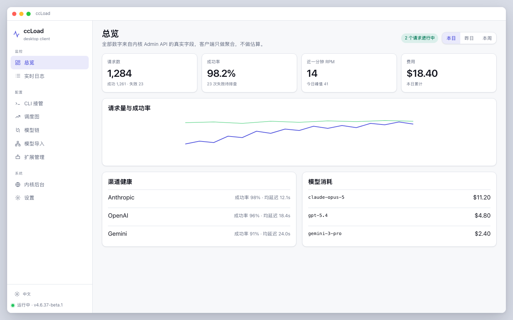

### Monitor · Live logs

The top list is in-flight requests (not in history yet). The table is finished ones. Filter by model, channel, or status, or show errors only. Turn “live” off if you do not want the laptop polling the kernel; refresh by hand instead.

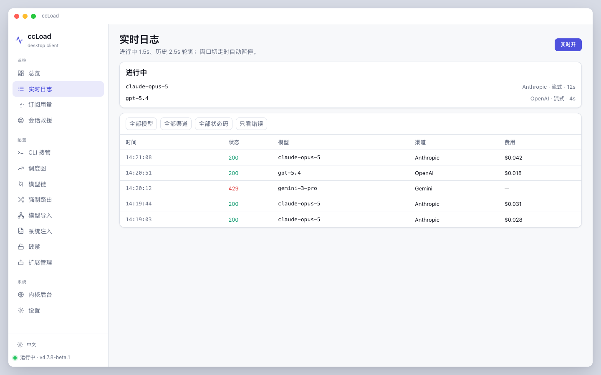

### Monitor · Subscription usage

Plan quota windows (5-hour / weekly / monthly) and what is left, per OAuth channel. Every number comes from the kernel, which samples the upstream quota endpoint while refreshing credentials. The client does not compute quota itself: every upstream reports it differently (Codex in percent, Z.ai in `limits[]`, xAI in cents), the kernel already normalised it once, and normalising again would only produce a second, disagreeing answer.

"Refresh quota" really does ask the upstream, so this page does not poll — it runs when you click. API-key channels are pay-as-you-go with no plan window and are not listed here.

### Monitor · Session rescue

For a session stuck on `400 too long`.

Claude Code decides when to auto-compact from the window the **model** declares, but through ccLoad the ceiling that actually stops you is the **relay's**. The classic trap is a model name carrying `[1m]` while the relay grants 500k: the threshold is measured against a denominator that does not exist, and by the time it fires you are past the real ceiling — after which `/compact` cannot get out either, because it has to send the whole transcript too.

This page strips images and over-long text out of the transcript, summarises in chunks when it has to, and keeps the last few turns verbatim, so the session can be resumed. **The token count is not an estimate**: every assistant record carries the usage the upstream reported, and the real context is `input_tokens + cache_read + cache_creation` — the only figure that matches the number in the 400. Reading `input_tokens` alone is off by an order of magnitude. A backup is taken before trimming.

### Configure · CLI takeover

Point Claude Code, Codex, Gemini CLI, Grok Build, and OpenCode at the current gateway. Already-pointed tools can be written again (to fix a half-edited file). Every write is snapshotted; “Snapshot history” in the corner rolls one CLI back. With sandbox on in Settings, this page only writes a side folder.

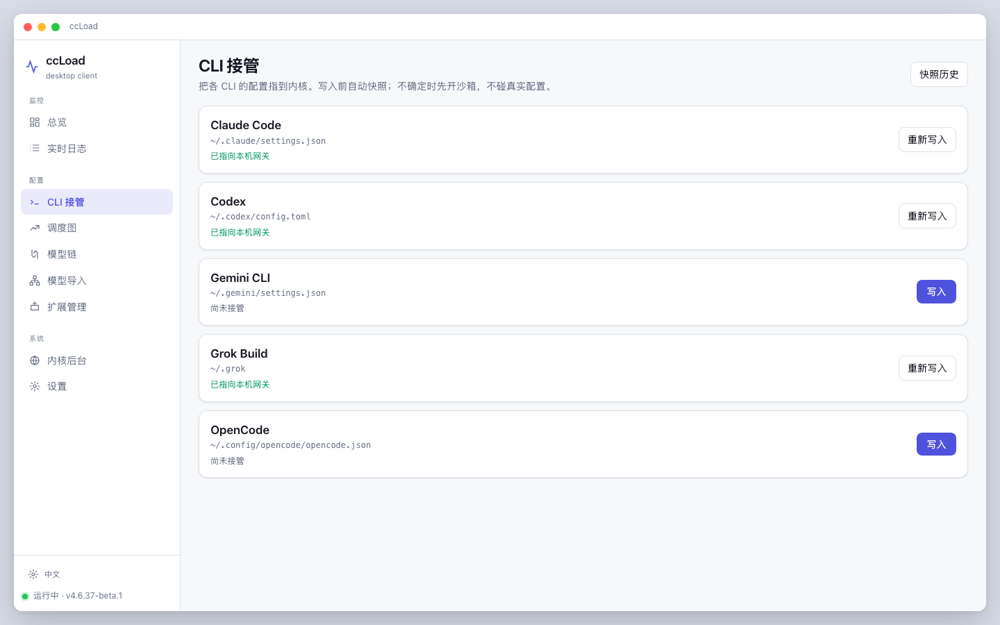

### Configure · Dispatch graph

A table for “this kind of work uses that provider’s that model.” After you apply it, CLIs only speak tier aliases (opus / sonnet / …). Failover and cooldown stay in the kernel. Contradictory orderings are blocked instead of silently picked.

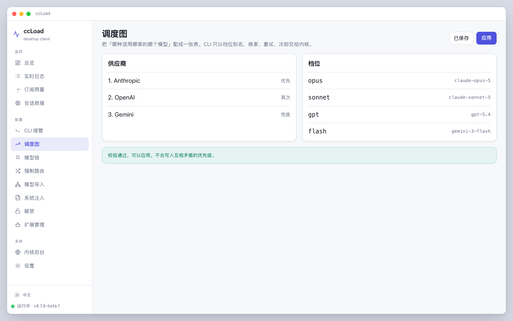

### Configure · Model chain

A fallback: try this, then that. Written as channels in decreasing priority so the kernel’s picker walks the whole chain. The graph is “how traffic is split”; the chain is “where it goes when something dies.”

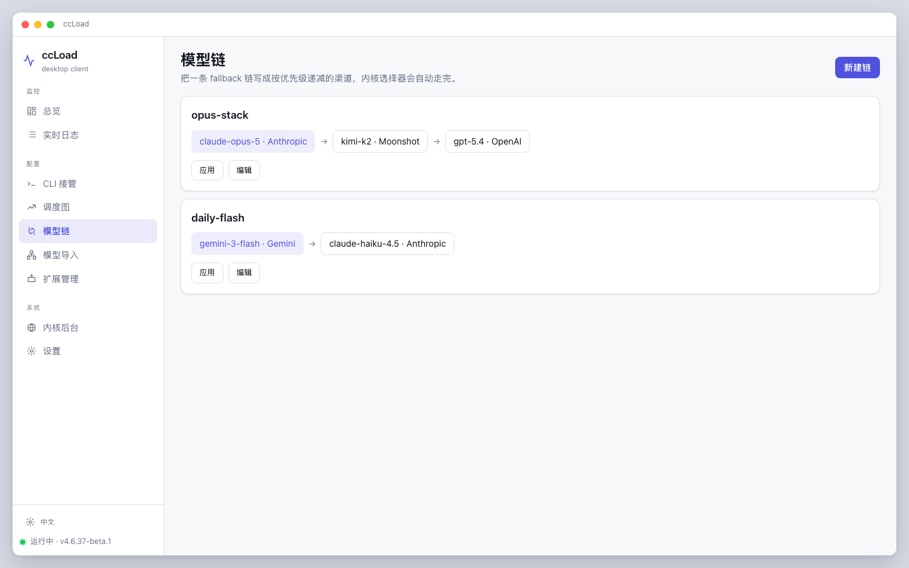

### Configure · Model import

Aliases your live channels can actually serve, appended to Codex / OpenCode catalogs. Claude Code has no catalog file, only a few slots: a row is written only if you pick opus / sonnet / … — otherwise it is skipped, so the model you are using is not overwritten.

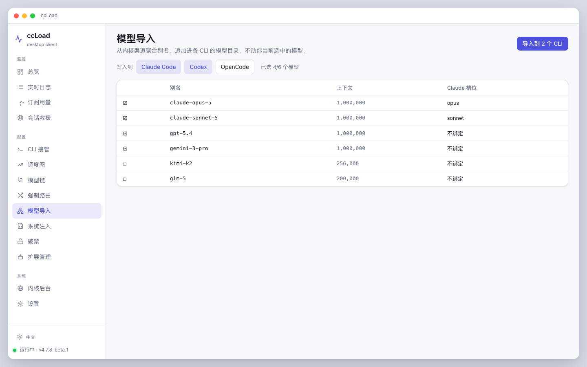

The two bundled MCP panels (vision and image) live at the bottom of this page — pick a model, pick which CLIs get it.

### Configure · System injection

Writes a managed block into each CLI's global instruction file (`CLAUDE.md` / `AGENTS.md` / `GEMINI.md`), which is loaded into the system prompt unconditionally at startup. **Only the text between our own markers is replaced; not one byte outside the block is touched** — `~/.claude/CLAUDE.md` is usually months of your own accumulated rules, and wiping it is not reversible.

Why it is needed: installing an MCP does not mean the model will use it. All it sees is a tool name and one line of description, so whether it remembers to call it is luck — and a text-only model does not even know it is blind. A rule in the system prompt is far stronger than a tool description.

Three optional blocks: how to use the vision MCP, how to use the image MCP, and your own rules. You can also attach one line per **installed third-party extension** describing when to reach for it — the usage notes you hand-wrote for Claude Code usually exist only in `~/.claude/CLAUDE.md`, invisible to the other four; write them once here and all five get them.

Ticking a box is not writing. Each row has its own Write / Update, and edited-but-unwritten state is called out. So is guidance written for a server that is not installed anywhere — that teaches the model to call a tool that does not exist, which it will hunt for, fail to find, and then improvise around.

### Configure · Session presets

Prepares an opening exchange and writes it out in each CLI's own session format, so you can pick it up with that tool's native resume. It is for freezing a repeated opening — role setup, project background, standing working agreements — instead of retyping it every time. You write the exchange; the client only lays it down in each format. Whether the model on the other end goes along with it is up to that model.

### Configure · Extensions

One row per MCP / Skill / Agent / Hook, with badges for which CLIs have it. Edit once, push to every CLI that has it. File formats stay native; writes are snapshotted first.

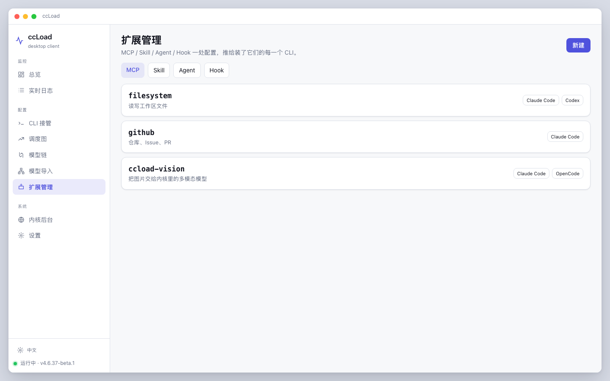

### System · Kernel admin

Channels, tokens, the kernel’s own logs and settings. This opens ccLoad’s stock admin in a separate window, so fields follow kernel upgrades. There is no thinner copy of those forms here.

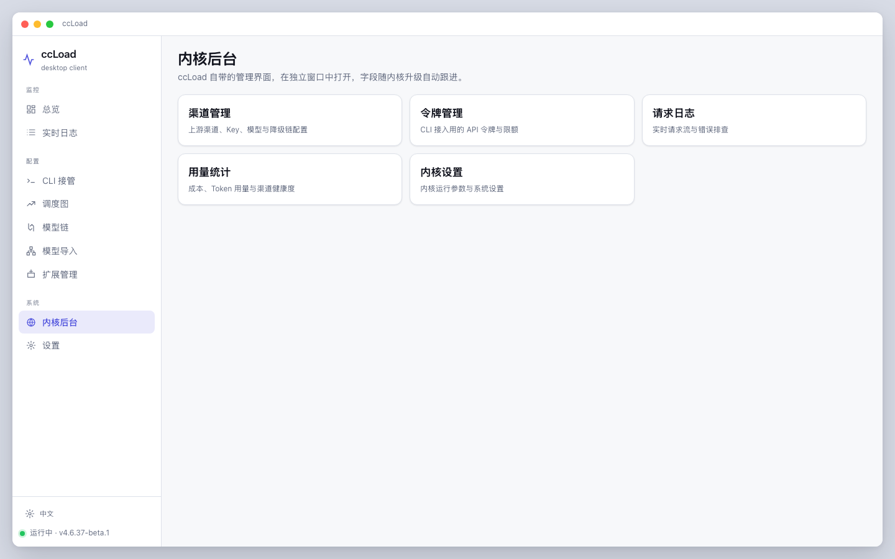

### System · Settings

Where the gateway lives: run one on this machine, or paste an instance you already have. Turn on sandbox CLI writes while you experiment. The page also lists Anthropic / OpenAI / Gemini entrypoints for tools that do not go through takeover.

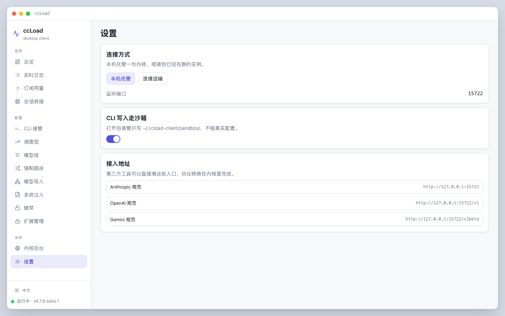

## Get it

[Releases](https://github.com/ChenYCL/ccload-client/releases)

| System | Download |
|---|---|
| macOS | `.dmg` / `.zip` (Intel and Apple Silicon in one file) |
| Windows | `.exe` |
| Linux | `.AppImage` or `.deb` |

macOS builds are unsigned for now: first launch is right-click the app → Open.

Turn on “sandbox CLI writes” while developing. Building from source and contributor rules: [AGENTS.md](./AGENTS.md).

### The kernel version inside the package

Every build compiles in a copy of the [ccLoad](https://github.com/caidaoli/ccLoad) kernel, pinned by a single-line file at the repo root: `KERNEL_VERSION`. Changing kernel version is editing that line — visible in the diff, identical for CI and for your laptop. The kernel source does not live in this repository (the hard rule is that we do not modify it).

Following upstream is automatic, on two tracks. `.github/workflows/kernel-sync.yml` checks the newest upstream release hourly and picks the output track from **what kind of release that was**:

| Upstream shipped | We ship | Client version |
|---|---|---|
| A prerelease (beta) | A beta package (prerelease) | Untouched |
| A stable release | A **draft** release, published by hand | Patch +1, and a tag is pushed |

Two gates: **the kernel is compiled before anything is committed** (upstream occasionally introduces a new build prerequisite, and that should fail in the sync pipeline rather than land an unbuildable pin on `main`), and the stable track produces a draft — the packages are hundreds of megabytes, so a human always clicks Publish.

Settings shows the bundled kernel and the running kernel side by side, so a mismatch is visible at a glance.

## License

MIT — [LICENSE](./LICENSE). The bundled [ccLoad](https://github.com/caidaoli/ccLoad) kernel is MIT as well.
